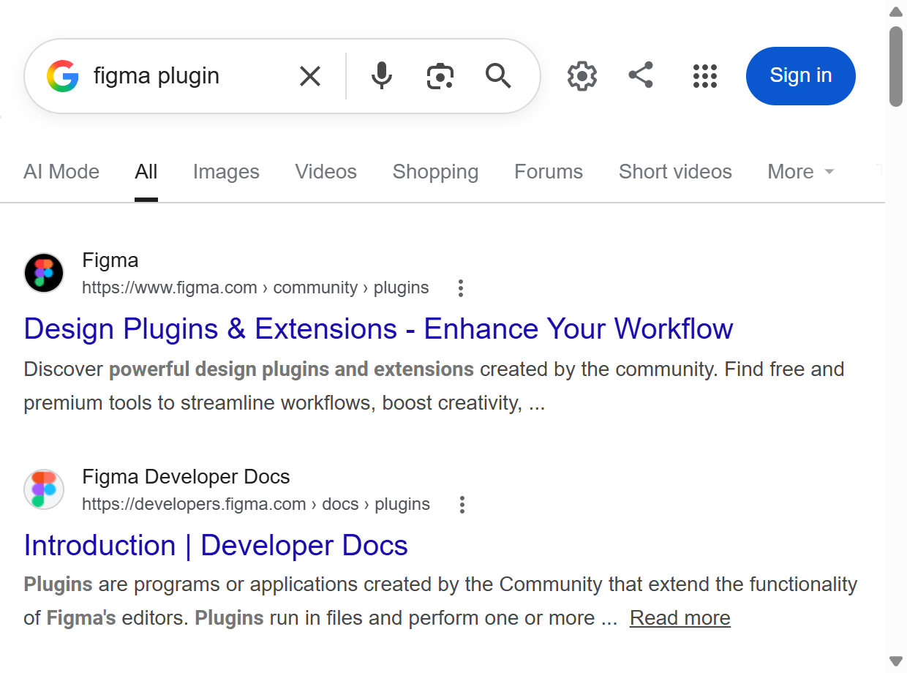

# Web to Figma

웹페이지를 **편집 가능한 피그마 레이어**로 복사하는 크롬 확장 프로그램입니다.
스크린샷 이미지가 아니라, 텍스트는 텍스트 레이어로 아이콘은 벡터 패스로 들어갑니다.

**소개 페이지 → https://bogeun35.github.io/web-to-figma/**
(설치 파일 다운로드 · 스크린샷 · 한국어/English/中文/日本語)



실제 구글 검색 결과 페이지를 변환하면 1,230개 DOM 노드가 1,557개 피그마 레이어로 들어옵니다.

## 사용법

1. 캡처할 웹페이지에서 툴바의 확장 아이콘을 클릭합니다.
2. 범위(페이지 전체 / 특정 영역)와 해상도를 선택합니다.
3. **클립보드로 복사**를 누릅니다.
4. 피그마 캔버스에서 <kbd>Ctrl</kbd>+<kbd>V</kbd>.

플러그인 설치나 파일 내보내기가 필요하지 않습니다.

## 무엇이 그대로 들어오나

| 항목 | 내용 |
|---|---|
| 텍스트 | 글자·색상·크기·굵기·자간·줄바꿈. 실제 텍스트 레이어 |
| 벡터 아이콘 | SVG를 진짜 벡터 패스로. 구멍 뚫린 도형도 재현 |
| 레이아웃 | DOM 계층을 유지한 프레임 트리, 절대 좌표 |
| 스타일 | 배경색·테두리·모서리 라운드 |
| 해상도 | 현재 브라우저 그대로 또는 390 / 768 / 1440 / 1920 / 2560 / 3440px |

지원 언어: 한국어 · English · 中文 · 日本語

## 설치

크롬 웹스토어 게시 전이므로 개발자 모드로 설치합니다.

1. 이 저장소를 내려받거나 클론합니다.
   ```bash
   git clone https://github.com/bogeun35/web-to-figma.git
   ```
2. 크롬 주소창에 `chrome://extensions` 를 입력합니다.
3. 우측 상단 **개발자 모드**를 켭니다.
4. **압축해제된 확장 프로그램을 로드** → 내려받은 폴더의 `extension` 디렉터리를 선택합니다.

## 권한을 사용하는 이유

| 권한 | 용도 |
|---|---|
| `activeTab`, `scripting` | 현재 탭에서 DOM·스타일을 읽어 캡처 |
| `clipboardWrite` | 변환 결과를 클립보드에 기록 |
| `storage` | 언어 설정과 선택한 영역 기억 |
| `debugger` | 해상도 프리셋 적용(뷰포트 에뮬레이션). 프리셋을 쓸 때만 붙고 끝나면 즉시 해제 |
| host 권한 | 이미지의 평균 색상을 계산하기 위해 이미지를 읽음 |

캡처한 데이터는 브라우저 안에서만 처리되며 외부로 전송되지 않습니다. 자세한 내용은
[PRIVACY.md](PRIVACY.md)를 참고하세요.

## 알려진 제한

- 이미지는 평균 색상 플레이스홀더로 들어옵니다. 피그마 클립보드 형식이 이미지 원본 바이트를 담지 못하고 해시 참조만 사용하기 때문입니다.
- 그라디언트와 그림자는 아직 지원하지 않습니다.
- 노드 수가 많은 페이지는 변환에 몇 초 걸릴 수 있습니다. 영역 선택을 사용하면 빨라집니다.

## 동작 방식

피그마가 클립보드에 쓰는 자체 형식(`fig-kiwi` 아카이브)을 직접 생성합니다.

```
DOM 순회 → 노드 트리 추출
  → 텍스트: 폰트 외곽선을 글리프 벡터로 인코딩
  → SVG: path를 벡터 네트워크로 변환
  → kiwi 스키마로 직렬화 → deflate 압축 → base64
  → text/html 클립보드 항목으로 기록
```

## 라이선스

MIT (see [LICENSE](LICENSE))

번들된 [Pretendard](https://github.com/orioncactus/pretendard) 폰트는 SIL Open Font License 1.1,
국기 아이콘은 [flag-icons](https://github.com/lipis/flag-icons) (MIT)를 사용합니다.

---

Figma는 Figma, Inc.의 상표입니다. 본 프로젝트는 Figma, Inc.와 관련이 없습니다.
